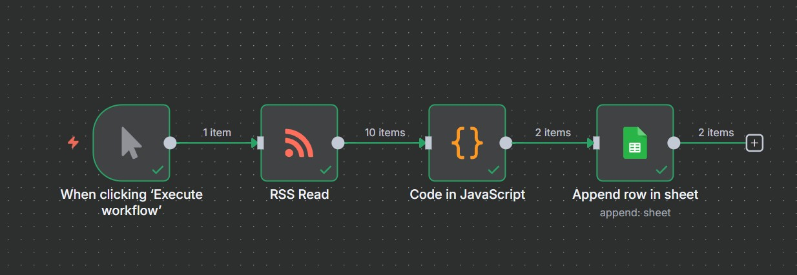

# 🚀  n8n 爬文極簡教學：AI 關鍵字文章追蹤器

本篇文章將說明，如何使用n8n打造一個爬取單一動態新聞網頁，並根據自訂的關鍵字抓取標題、新聞網址、刊登日期，和摘要的自動化流程。本文旨在呈現需要注意的關鍵細節，因此不詳細記錄創建過程。流程步驟如下：

1. 抓取動態網站文章
2. 只保留標題有「AI」的文章
3. 自動存入 Google Sheets

## 💡 流程核心思維：獲取資料策略

面對網站資料，首先要判斷網站的形式，以確認爬取方式：

### 網站類型與處理策略對照表

| 網站類型 | 處理策略 | 搭配 n8n 節點 | 核心原因 |
| :--- | :--- | :--- | :--- |
| **動態載入** (內容由 JS 生成) | 尋找 RSS 連結 | `RSS Read` | 繞過複雜的動態爬蟲 (Puppeteer)，選擇最穩定的訂閱接口。 |
| **靜態呈現** (內容在 HTML 原始碼) | 直接爬取 | `HTTP Request` | 簡單快速，適用於傳統網頁。 |

- **本流程的選擇**： 目標是爬取**動態網站**，因此使用欲爬取網站的RSS連結，並搭配n8n的**RSS Read**節點，實現爬取網站資料的目標。
  
## 🛠️ 流程節點總覽 

- **節點1-RSS Read:** 讀取單一 RSS Feed 文章。
- **節點2-Code in JavaScript:** 執行所有資料清理、過濾和結構化處理。此過程包括設定關鍵字，本流程的關鍵字為「AI」。
- **節點3-Google Sheets:** 將乾淨資料寫入試算表。

實際節點呈現如下圖：


## 💻 Code 節點：資料處理與過濾Code 

Code節點的任務：
1. 清潔資料 (移除亂碼)；
2. 提取標題、網址、摘要、張貼日期；
3. 只保留標題含 "AI" 關鍵字的文章。
   
清理和提取資料的程式碼，為透過跟AI多次對話後獲得，提示詞範例如下：

```
請基於輸入的RSS文章資料，撰寫Code節點程式碼。你需要執行以下任務：

1.資料淨化：實作stripHtmlTags函式，用於移除標題和摘要中的HTML標籤及&#8217;等常見亂碼。

2.精準過濾：只保留標題中包含關鍵字"AI"的文章。

3.結構化輸出：輸出JSON結構必須包含 Title (已淨化)、URL、Summary (已淨化)，並使用 || 邏輯提取最穩定的PublishedDate。

```

### 最終版本的程式碼


```

// 函式：使用正規表達式移除所有 HTML 標籤及 HTML 實體
function stripHtmlTags(html) {
    // 匹配所有 <...> 格式的標籤並替換為空字串
    if (!html) return '';
    
    // 移除 HTML 標籤
    let plainText = html.replace(/<[^>]*>/g, '');
    
    // 移除常見的 HTML 實體 (如 &nbsp; 和 &#038;)
    // 針對 ' (單引號) 和 " (雙引號) 等常見實體進行替換
    plainText = plainText.replace(/&nbsp;/g, ' ')
                       .replace(/&#038;/g, '&')
                       .replace(/&#8216;/g, '‘') // 左單引號
                       .replace(/&#8217;/g, '’') // 右單引號
                       .replace(/&apos;/g, "'")  // 單引號
                       .replace(/&quot;/g, '"')  // 雙引號
                       .replace(/&amp;/g, '&')
                       .replace(/&lt;/g, '<')
                       .replace(/&gt;/g, '>');


    // 移除連續的換行和空白，讓文本更乾淨
    plainText = plainText.replace(/(\r\n|\n|\r)+/gm, ' ').trim();
    
    return plainText;
}

// 定義我們需要篩選的關鍵字
const keyword = "AI"; 

// 儲存符合條件的文章
const filteredItems = [];

// n8n 的 $input.all() 遍歷 RSS Read 節點輸出的每一篇文章項目
for (const item of $input.all()) {
    const article = item.json;

    // RSS Read 節點會將 RSS 標籤轉換為 JSON 屬性
    const rawTitle = article.title || '';
    const url = article.link || ''; 
    
    // 將原始標題轉換為純文字 (淨化 HTML 實體)
    const title = stripHtmlTags(rawTitle);
    
    // 依序檢查多個可能的日期欄位名稱
    const publishedDate = article.published || article.pubDate || article.date || '';
    
    // 嘗試獲取文章摘要/描述
    const rawSummary = article.description || article.content || ''; 
    
    // 將原始摘要轉換為純文字
    const summary = stripHtmlTags(rawSummary);

    // 篩選邏輯：只檢查 Title 中是否包含關鍵字
    const keywordFoundInTitle = title.toUpperCase().includes(keyword.toUpperCase());
    
    // ⭐ 關鍵修改：keywordFound 現在只等於 keywordFoundInTitle
    const keywordFound = keywordFoundInTitle; 

    // 確保標題和連結都存在，且關鍵字出現在標題中
    if (title && url && keywordFound) {
        
        filteredItems.push({
            json: {
                // 輸出乾淨的欄位名稱
                Title: title, // 使用淨化後的標題
                URL: url,
                Summary: summary,
                PublishedDate: publishedDate 
            }
        });
    }
}

// 返回符合條件的 JSON 數據
return filteredItems;

```
# ☁️ Google Sheets 節點設定

我希望Google Sheet可以：

1. **持續更新文章：**
   - Operation欄位應選擇**Append Row** (附加行)
2. **資料寫入的欄位對應正確:**
   - 確保在Google Sheets節點中的Mapping Column Mode欄位，手動對應的欄位名稱 (Title, URL 等) 必須完全對應到Code節點輸出給你的JSON變數 ({{ $json.Title }})。
   - 若確保已創建的Google Sheets欄位填寫正確，則可選擇Map Automatically。 
  

# 🎓 下一步： 挑戰「多個 RSS Feed 讀取」
在成功創建抓取單一動態新聞網站的工作流後，將挑戰一次抓取多個動態新聞網站的工作流，打造個人的關鍵字新聞追蹤器。
